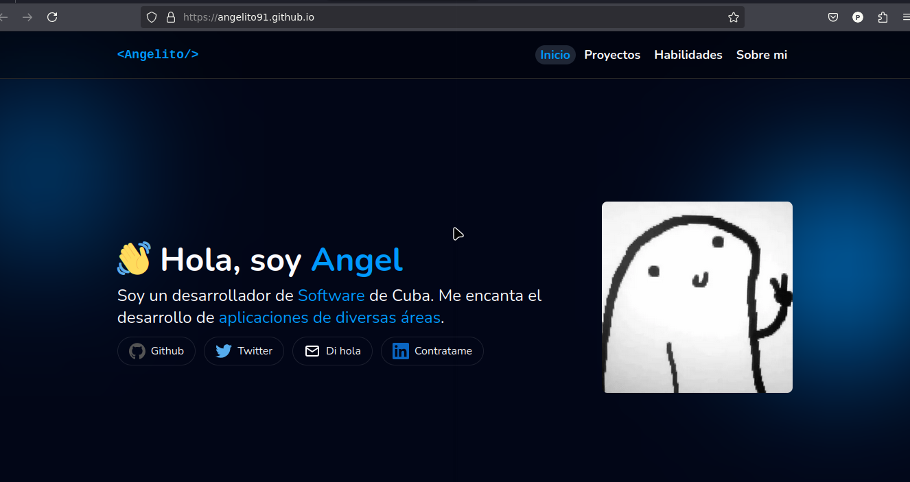

# Mi Portfolio Web 

La pagina web [Aquí](https://angelito91.github.io/portfolio)



## 🛠 Instalar
- Debes tener `pnpm` instalado

- Descargar el repositorio
    ```
    git clone https://github.com/Angelito91/portafolio.git
    ```
- Instalar las dependencias
    ```
    pnpm install
    ```
- Ejecuta
    ```
    pnpm run dev
    ```

### 📌 Tecnologías
- Astro 🚀
- JavaScript ⚡
- Tailwindcss ⭐

